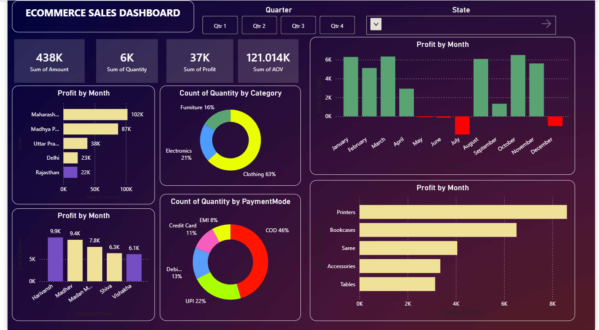

# 📊 E-Commerce Sales Dashboard | Power BI

An interactive **Power BI Dashboard** designed to analyze e-commerce sales data and uncover actionable business insights. This project leverages data modeling, DAX calculations, and interactive visualizations to help users monitor sales performance and make data-driven decisions.

---

## 🚀 Project Overview

This dashboard provides a comprehensive view of an e-commerce business by tracking sales, profit, quantity sold, and customer purchasing trends. Users can interact with the dashboard using filters, slicers, and drill-down functionality to explore insights across different dimensions such as state, category, sub-category, and payment mode.

---

## 📌 Features

* Interactive dashboard to monitor online sales performance
* Dynamic KPI cards for:

  * Total Sales
  * Total Profit
  * Total Quantity Sold
  * Average Order Value (AOV)
* Drill-down analysis using filters and slicers
* Data modeling with relationships between multiple datasets
* Custom DAX measures and calculated columns
* User-driven parameters for interactive reporting
* Business-focused insights through multiple visualizations

---

## 📊 Dashboard Visualizations

The dashboard includes:

* KPI Cards
* Bar Chart
* Clustered Bar Chart
* Donut Chart
* Slicers
* Interactive Filters

---

## 📁 Dataset

The project uses two datasets:

```
Orders.csv
Details.csv
```

These datasets contain information related to:

* Orders
* Customers
* States
* Product Categories
* Sub-Categories
* Sales Amount
* Profit
* Quantity
* Payment Mode

---

## ⚙️ Technologies Used

* Microsoft Power BI
* Power Query
* DAX (Data Analysis Expressions)
* Data Modeling
* CSV Files

---

## 📈 Key Insights

The dashboard enables users to:

* Analyze overall sales performance
* Monitor monthly profit trends
* Identify top-performing states
* Compare category and sub-category sales
* Understand customer purchasing behavior
* Analyze preferred payment methods
* Track quantity sold across products

---

## 🛠 Data Preparation

The following steps were performed before visualization:

* Imported raw CSV datasets
* Cleaned and transformed data using Power Query
* Created relationships between tables
* Built calculated columns and DAX measures
* Designed an interactive dashboard with slicers and filters

---

## 📂 Repository Structure

```
Ecommerce-Sales-Dashboard/
│
├── Ecommerce_Sales_Dashboard.pbix
├── Orders.csv
├── Details.csv
├── Dashboard.png
└── README.md
```

---

## 📸 Dashboard Preview

> Add a screenshot of your dashboard below.

```markdown

```

---

## 🎯 Skills Demonstrated

* Business Intelligence
* Data Visualization
* Dashboard Design
* Data Cleaning
* Data Modeling
* DAX
* Power Query
* Analytical Thinking
* Interactive Reporting

---

## 💡 Future Improvements

* Add time-series forecasting
* Create customer segmentation analysis
* Include profit margin KPIs
* Add dynamic report tooltips
* Integrate SQL as the data source
* Enable Row-Level Security (RLS)

---

## ⭐ If you found this project useful, consider giving it a star!

Feel free to fork this repository, suggest improvements, or connect with me to discuss data analytics and Power BI projects.
